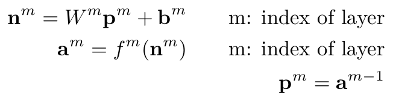

<center>
<h1>
In The Name Of ALLAH
</h1>
<h2>
Advanced Programming - Homework 3
</h2>
<h2>
Dr.Amir Jahanshahi
</h2>
<h3>
Deadline: Wednesday, 13 Farvardin - 23:00
</center>

#  Introduction
In this homework, you'll get familiar a little with **neural networks**. Also, you'll estimate some functions using them. Isn't that wonderful?! In this way, you must use the **Matrix** class implemented in the last homework by yourself. You can also change it if you think it's necessary. In the end, you must do all your codes in **Matrix**, **dataset**, **result**, **neuralnet** and **aphw3** header and cpp files.


#  Dataset Class
In this class, you'll manage whatever we need for storing our data. Each data element or sample in our dataset is composed of an input part and a target part. We give the inputs to our neural net and we expect it to generate an output similar to the targets. That's all. Since we're trying to train a neural net, we need a dataset. We divide our dataset into 2 parts: **Train** and **Test**. We use the *train* data to teach the neural network about the patterns embedded in our data. After that, we must test our neural network to see if it has learned enough or not. So we use the *test* data. 

Dataset class must have the following member variables. No need to mention that all of them *must* be private.

* 
  ```c++
  Matrix inputs;
  ```
  Matrix of all input parts of samples of dataset. Each column of this matrix is a sample input.

*
  ```c++
  Matrix targets;
  ``` 
  Matrix of all target parts of samples of dataset. Each column of this matrix is a sample target.

*  
  ```c++
  Matrix train_inputs;
  ```
  Matrix of inputs of the *train* part of dataset. Each column of this matrix is a sample input of the *train* part.

*  
  ```c++
  Matrix train_targets;
  ```
  Matrix of targets of the *train* part of dataset. Each column of this matrix is a sample target of the *train* part.

*  
  ```c++
  Matrix test_inputs;
  ```
  Matrix of inputs of the *test* part of dataset. Each column of this matrix is a sample input of the *test* part.

*  
  ```c++
  Matrix test_targets;
  ```
  Matrix of targets of the *test* part of dataset.  Each column of this matrix is a sample target of the *test* part.

*  
  ```c++
  double percentage{70};
  ```
  This variable tells the class how to divide data into train and test parts. When it is 70, for example, it takes 70% of data randomly into the train part and the other 30% into the test part of dataset.

*  
  ```c++
  size_t no_of_samples;
  ```
  Number of all samples in the dataset.

*
  ```c++
  size_t input_dim;
  ```
  Dimension of inputs of dataset.

*  
  ```c++
  size_t target_dim;
  ```
  Dimension of targets of dataset.

Dataset class must have the following member functions too.

*  
  ```c++
  Dataset(Matrix inputs, Matrix targets, double percentage=70);
  ```
  Note that in this constructor, you must not change the order of samples of dataset in the ```inputs``` and ```targets``` variables. And in the constructor, test samples should be the last samples of input and target matrices.

*  
  ```c++
  size_t getNoOfSamples();
  ```

*  
  ```c++
  size_t getNoOfTrainSamples();
  ```

*  
  ```c++
  size_t getNoOfTestSamples();
  ```

*  
  ```c++
  size_t getInputDim();
  ```
*  
  ```c++
  size_t getTargetDim();
  ```
*  
  ```c++
  Matrix getInputs();
  ```

*  
  ```c++
  Matrix getTargets();
  ```

*  
  ```c++
  Matrix getTrainInputs();
  ```

*  
  ```c++
  Matrix getTrainTargets();
  ```

*  
  ```c++
  Matrix getTestInputs();
  ```

*  
  ```c++
  Matrix getTestTargets();
  ```

*  
  ```c++
  void shuffle();
  ```
  This functions rearranges the data samples in the all matrices of the class in a random manner. So after calling it, the order of samples in columns must change randomly.

*  
  ```c++
  void show();
  ```
  This function shows some properties of the dataset, such as number of samples, number of train samples and test samples, input and target dimensions in a beautiful way like the following figure.

  


*  ‍‍‍‍‍You must also write the ```[ ]```operator for your class such that, for example, for a dataset object of this class ```dataset[10][0]``` returns the input part of the 11-th sample of dataset (```inputs``` variable) as a Matrix object and ```dataset[10][1]``` returns the target part of the 11-th sample of dataset (```targets``` variable) as a Matrix object. So, the following code must return the value of the first dimension of the input part of the 11-th sample of dataset.
  
    ```c++
    std::cout<<dataset[10][0][0][0];
    ```

*  
  ```c++
  Dataset operator+(const Dataset& dataset);
  ```
  You must also implement the **+** operator such that we can merge two datasets together. In this case, the result input must be a concatenation of both given datasets inputs. Also, the result target must be a concatenation of both given datasets targets. Seperation of data samples into *train* and *test* parts must also be done randomly again (separation percentage is the default 70).

*  The following code should also do just like the ```show()``` method of your class.
  ```c++
  std::cout<<dataset<<std::endl;  \\ dataset is a Dataset object
  ```
  **Question1**: How do you do this? In order to access private variables of the Dataset object, what would you do without using *getter* functions? Explain it.
  


# NeuralNet Class
In this class, you'll implement a neural network so that you can train it easily. Isn't that amazing?! It's good to first talk a little about neural nets and their training algorithm. To make a long story short, you can look at a neural net like a black box. It gets some inputs and some targets (desired outputs) and tries to find the mapping between the inputs and targets. So that whenever you give it an input, it can generate a proper output for you (if trained well before!). For example, suppose you create a neural net to find out if there is any ball in a given image. The input of your neural net is an image and the output is a number (1 if there is ball in the image and 0 otherwise). You prepare a dataset of many images, some containing a ball. So each sample of your dataset has two parts: the input part is an image and the target part is a number telling that if there is a ball in the image. So your neural net gets the dataset and tries to learn the pattern embedded in it. This process is called **training**. After the neural net has been trained enough, it can say that is there any ball in a given image or not. 

## Notation and Literature
The fundamental unit of each neural network is called **Neuron**. Each neuron gets an input vector (**p**) it multiplies each element of the input in a scalar. These scalars together make the **Weights** of the neuron. The products of input elements and weights are summed and a bias term is added to the result. So far, the result is shown by *n*. Then this *n* goes into a function (called **Activation Function**) and generates the ouput of the neuron (*a*). Below, you can see the model of a neuron.


A bunch of neurons with the same input vector **p** make a **layer**. So we can form a vector **n** and a vector **a** for the whole layer. Each element of these vectors corresponds to one of the neurons. So **a** is the ouput vector of the layer (output of all neurons stacked together in a vector). The output of a layer can be the input to the next layer and so on. So we use superscripts for the no of layers in our notation.



## Forward Propagation
As mentiond before, a neural net gets an input and generate an output from that. But how? Well the input is given to the first layer and the output of the first layered is found after that. The the output of the first layer goes to the second layer as its input. The output of the second layer is then found easily. This process goes on until the last layer ouput is found which is the output of the neural net. This process is called **forward propagation**. Below you can see the relations of forward propagation for a network with two layers.


## Backpropagation
The main problem to solve for a neural net is to find the proper weights and biases. As you can remember from homework 1, updating weights and biases is done by minimizing a loss function. In this homework, the loss function is just the same as the one in homework 1 which is average mean square of errors. This process is called **backpropagation**. We just consider backpropagation for a network with 2 layers here. The general case would be discussed in the TA class soon. Given a sample input and a sample target, you update the weights as below.


## Training the Network
For the training process, in each iterations we do the followings:

  We choose a random sample from the dataset. After giving the sample input to the neural net, forward propagation is done so that the network output is generated. After that backpropagation is done with the sample target and the weights and biases are updated. Obviously, with a proper learning rate, in each iteration, the loss function must get smaller and smaller.

##  Some other notes
In all above discussion we did not mention what our activation functions (f) can be. For each layer we assume all the neurons have the same activation function. We use one of the following 2 famous activation functions for each layer.
  * Sigmoid

  

  * Linear
  

Now you can simply implement the NeuralNet class. Your NeuralNet class must have the following member variables.

*  
  ```c++
      Matrix w1; // Weights of layer 1
      Matrix w2; // Weights of layer 2
      Matrix b1; // Biases of layer 1
      Matrix b2; // Biases of layer 2
      Matrix a1; // Output of layer 1
      Matrix a2; // Output of layer 2
      Matrix n1; // n vector for layer 1
      Matrix n2; // n vector for layer 2
      Matrix s1; // s vector for layer 1
      Matrix s2; // s vector for layer 2 
  ```
  As mentioned above in the training algorithm.

*  
  ```c++
  const char* af1{"Sigmoid"};
  const char* af2{"Sigmoid"};
  ```
  Activation functions of the second and the third layer. It can be any of the following activation functions.
  *  "Sigmoid"
  *  "Linear"

* 
  ```c++
  size_t hidden_layer_neurons{3};
  ```
  No of neurons in the hidden layer of the network.

*  
  ```c++
  double lr{0.01};
  ```
  Learning rate for the training algorithm.

*  
  ```c++
  size_t max_iters{1000};
  ```
  Maximum iterations before convergence to stop.

*  
  ```c++
  double min_loss{0.01};
  ```
  Minimum test loss before convergence to stop.

*  
  ```c++
  Dataset dataset;
  ```
  Given dataset to the network.

Your NeuralNet class should also have the following member functions.

*  
  ```c++
  NeuralNet(Dataset dataset, size_t hidden_layer_neurons, const char* f1 = "Sigmoid", const char* f2 = "Linear", double lr = 0.1, size_t max_iters = 10000, double min_loss=0.01);
  ```
*  
  ```c++
  Matrix forwardPropagate(Matrix& input);
  ```
  This function gets a sample input for the neural net and do the forward propagations process. Finally, it returns the output of the network as a Matrix object.

*  
  ```c++
  void backPropagate(Matrix& input, Matrix& target);
  ```
  This functions does the backpropagation for a sample data. It gets a sample input and its corresponding target and does the forementioned backpropagation algorithm to update weights and biases.

*  
  ```c++
  double trainLoss();
  ```
  This function computes the average loss function on the train part of dataset.

*  
  ```c++
  double testLoss();
  ```
  This function computes the average loss function on the test part of dataset.

*  
  ```c++
      void setW1(Matrix& w);
      void setW2(Matrix& w);
      void setB1(Matrix& b);
      void setB2(Matrix& b);
      Matrix getW1();
      Matrix getW2();
      Matrix getB1();
      Matrix getB2();
  ```
  Setter and getter functions of weights and biases of the network.

* 
  ```c++
  Result fit();
  ```
  This function does all the training process of the neural network. In each iteration, it takes a random sample from the *train* part of the dataset. It does a forward propagation with it and afterward it backpropagates to update weights and biases. And these operations is repeated for each iteration until convergence.

  After training has been done, it makes a ```Result``` object (descripted below) in which it gives a report of the training process.

* 
  ```c++
  void show();
  ``` 
  This function shows a description of the neural network like the following figure.

  

*  The following code should also do just like the ```show()``` method of your class.
  
    ```c++
    std::cout<<nn<<std::endl;  \\ nn is a NeuralNet object
    ```
  
# Result Class
This tiny class gives a report of the training process of a neural network. It has the following member variables.

* 
  ```c++
      double train_loss;
      double test_loss;
      size_t no_of_hidden_neurons;
      double lr{};
      size_t iters{};
      const char* af1;
      const char* af2;
  ```
  All of these variables are discussed in the NeuralNet class.

The following member functions are to be implemented.

* 
  ```c++
    Result(double train_loss, double test_loss, size_t no_of_hidden_neurons, double lr = 0.01, size_t iters = 10000, const char* af1 = "Sigmoid", const char* af2 = "Linear");
  ```

* 
  ```c++
    Result(double test_loss);
  ```
  In this constructor, you just get the test loss. In this case set train loss to -1, no of hidden neurons to 0 and all other variables must have their default values.

* You must also implement comparison operators so that all the codes below can run without any errors. Note that between two Result objects, the one with less test_loss is considered to be smaller than the other one.
  ```c++
  std::cout<< result_A < result_B << std::endl;
  std::cout<< result_A >= result_B << std::endl;
  ```
 **Question2**: How would you implement *all* comparison operators without actually coding all of them? Explain how it works.

  **Question3**: Right now the following code runs without any error in your program. Tell us why? We want the compiler not to compile it, what should we do to the constructor? Do you know any other way?
  
  ```c++
  Result r1{15};
  if (r1>10)std::cout<<"Hi there!"<<std::endl;
  ```
  
* 
  ```c++
  double getTestLoss();
  ```

* 
  ```c++
  void show();
  ``` 
  This function shows a description of the result object like the following figure.

  

*  The following code should also do just like the ```show()``` method of your class.
  
    ```c++
    std::cout<<r<<std::endl;  \\ r is a Result object
    ```

# Other Functions
You must implement the following functions too. They all must be implemented in **aphw3.cpp** and **aphw3.h** files.

* 
  ```c++
  Dataset loadFuncDataset(const char* filename);
  ```
  This function gets a csv filename and turn it into a dataset. Note that it is assumed that the data is for a function with single output and multiple (or single) input. Each column of the csv file is a data sample and the last row is the target, other rows are the inputs.

* 
  ```c++
  std::vector<Result> testNeuralNets(Dataset& dataset, std::vector<size_t>& hidden_neurons, double lr=0.01, size_t max_iters = 10000, const char* af1 = "Sigmoid", const char* af2 = "Linear");
  ```
  This function generates a bunch of neural networks with a given dataset. For each neural network, the no of hidden layers must be one of the numbers in the ```hidden_neurons``` vector given to the function. In other words, for each number in ```hidden_neurons``` vector, you generate a NeuralNet object with than number of hidden neurons. Each neural net must train. Hence you have a bunch of results. Just return a vector containing those results.

*  
  ```c++
  Result findBestNeuralNet(Dataset& dataset, std::vector<size_t>& hidden_neurons, double lr=0.01, size_t max_iters = 10000, const char* af1 = "Sigmoid", const char* af2 = "Linear");
  ```
  Like the last function, you generate a bunch of neural networks and then return the best result (the one with the least test loss).

* 
  ```c++
  void estimateFunction(const char* filename, size_t hidden_neurons_no);
  ```
  This function gets a csv filename, generate a dataset from it. After that, it creates a neural net with the given number of hidden layers (all other arguments of the neural net must be default ones) and show the comparison between neural net outputs and target values in a beautiful way like the below figure. Note that it is assumed that the function has a single variable output and can have as many inputs as possible.

  


