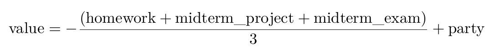
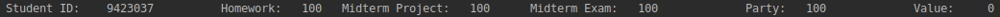
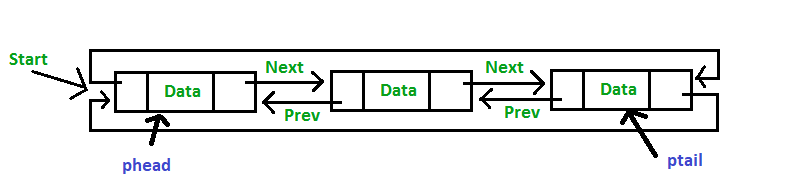
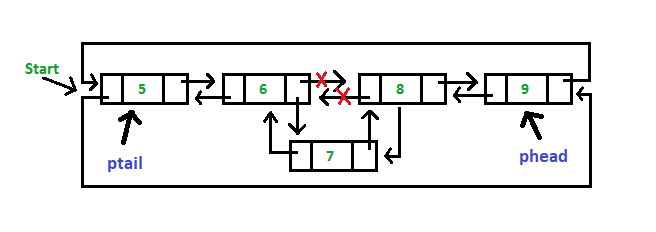
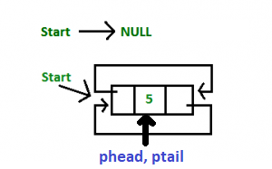
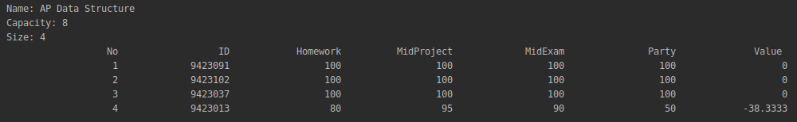

<center>
<h1>
In The Name Of ALLAH
</h1>
<h2>
Advanced Programming - Homework 4
</h2>
<h2>
Dr.Amir Jahanshahi
</h2>
<h3>
Deadline: Wednesday, 3 Ordibehesht - 23:00
</center>
  
#  Introduction
In this exciting homework, you're going to implement a special **data structure** for the AP course. We've decided to have a second midterm exam, but due to the limits of resources, unfortunately, it isn't possible to take the exam from all the students. So we need to select only a few of our dear students to take the exam. We need a data structure to select students and we think you are the best people on earth to implement it. Technically speaking, we need a **priority doubly circular linked list** data structure and we're going to specialize it for our course. Let's do it.


#  Student Class
Since we're doing all these efforts for our dear students, it would be respectful if we had a **Student** class. So implement it. This class has the following member variables.

*  
  ```c++
  long id{};
  ```
 Representing the student's id. (private)

*
  ```c++
  double homework{};
  ``` 
Representing the student's homeworks grade. (private)

*
  ```c++
  double midterm_project{};
  ```
Representing the student's midterm project grade. (private)

*
  ```c++
  double midterm_exam{};
  ```
Representing the student's midterm exam grade. (private)

*
  ```c++
  double party{};
  ```
Representing the student's amount of friendship with the TAs! (very private :-))

Besides, it has the following member functions.

*
  ```c++
  Student (long id, double hw, double mid_proj, double mid_exam, double party=50);
  ```
  **Note**: All the data except the homework grades (which are real grades) are generated randomly! So don't get excited!

This constructor gets all informations of a student and creates it's object.

*
  ```c++
  void setID(long id);
  ```

*
  ```c++
  long getID();
  ```

*
  ```c++
  void setHomework(double hw);
  ```

*
  ```c++
  double getHomework();
  ```

*
  ```c++
  void setMidtermProject(double project);
  ```

*
  ```c++
  double getMidtermProject();
  ```

*
  ```c++
  void setMidtermExam(double exam);
  ```

*
  ```c++
  double getMidtermExam();
  ```

*
  ```c++
  void setParty(double party);
  ```

*
  ```c++
  double getParty();
  ```

*
  ```c++
  double value();
  ```
This function determines the likelihood of a student to take the exam, called value. This quantity is measured from the below formula.



*
  ```c++
  void show();
  ```
This function displays informations of a student in a beautiful way like below.



*  The following code must work just like the **show()** method you implemented in the last part.

  ``` c++
  std::cout << student << std::endl;
  ```
  

  
#  APDS Class
This class represents our exclusive data structure, AP Data Structure. We have reached to the conclusion that it's better to be a **Priority Doubly Circular Linked List** with some changes for the sake of AP of course! 

In a few words, a *doubly linked list* data structure is the one that each of its items point to their next and previous items. An ordinary linked list is the one that *push* and *pop* operations take place in its first (head) and last(tail) items. But it's not what we need. We need a *priority* linked list so that the items are in a sorted order (sorted by value of students!). It should also be *circular* so that the first item (head) points to the last item (tail) too (and vice versa). So as mentioned before, we need a **Priority Doubly Circular Linked List**. You can see how this data structure works in the below figures.







Your APDS class must have the following member variables.

*  **Item**: This is a class, defined and implemented in the private part of APDS class. It has the following member variables.

    *
      ```c++
      Student* ps
      ```

    * 
      ```c++
      Item* pnext
      ```

    * 
      ```c++
      Item* pprev
      ```

and the following constructor.
        
  *
      ```
      Item(Student&)
      ```

  *  **Question1**: Why it isn't possible to pass the Student object by value to the constructor? Explain.

Other member variables and functions of the APDS class are presented below.

* 
  ```c++
  Item* phead;
  ```

This pointer always points to the item with the student with the maximum value in the data structure.

* 
  ```c++
  Item* ptail;
  ```
This pointer always points to the item with the student with the minimum value in the data structure.

*
  ```c++
  size_t size;
  ```
This variable tells us how many students do we have currently in our data structure.

*
  ```c++
  size_t capacity;
  ```
This variable tells us the capacity of our data structure. In other words, it tell us the maximum number of students we can have in our data structure. Its value must be 3 by default.

*
  ```c++
  std::string name{"AP Data Structure"};
  ```

APDS must also have the following member functions.

*
  ```c++
  APDS(std::vector<Student>& students, size_t capacity=3);
  ```
This constructor gets a vector of students and pushes all of them to the data structure. Obviously, there may be cases in which due to the APDS capacity only some of students of this vector get into the class.

*
  ```c++
  bool push(Student&);
  ```
This function gets a student and tries to push it to the data structure if possible. The new data (student) must go to a place in which all the items of the data structure remain in a sorted manner (remember the term *priority*). If the data structure is full (size and capacity have the same values) and the student's value is less than all of those inside the data structure, it cannot get in. But if the data structure is full and the student's value is not less than all of those inside, it must get in and the item with the least value must get out. If the student gets in this function, it must return **true**, otherwise, it must return **false**.

*
  ```c++
  bool pop();
  ```
This function removes the student with the least value (tail) from the data structure and returns **true**. If the data structure is empty and there's no one to remove, it returns **false**.

*
  ```c++
  Student* searchByID(long id);
  ```
This function searches for a particular student in the data structure. If we have that student, it returns its address. Else, it returns a null pointer.

*
  ```c++
  Student& go(int n);
  ```
This function must start from the first student (head), the one with the maximum value, and go to next student and do this n steps. If n is negative, it must go in the previous student and do this n times. No need to mention that n can be greater than the capacity and due to the *circular* property of our data structure there would be no problem with this.

*
  ```c++
  void show();
  ```
This function must display our data structure in a beautiful way like the below figure.



  **Question2**: 
Does this function support the following code block? If no, what should you do to solve it without changing the argument type? Do it!
  
  ```c++
  const APDS ap{getData("APHW3Data.csv")};  //  getData() is defined bellow!
  ap.show();
  ```

*  The following code must also work just fine like the **show()** method.

  ```c++
  std::cout << apds << std::endl; 
  ```

* 
  ```c++
  void setCapacity(size_t i);
  ```
This function changes the capacity of our data structure. In case of the new capacity, i, being less than the previous one, students with the least values must get out so that nothing is wrong with our data structure.

*
  ```c++
  void setName(std::string s)
  ```
This function, easily, changes the data structure name variable to ```s```.

  **Question3**: Since name is very important to us, we need your code to be ok with the following code block. Explain what's the problem and what changes should we do to make this code ok.
  
  ```c++
    const APDS ap{apstudents};
    ap.setName("AP1398");
    show(ap);
  ```


* You must also implement the **[ ]** operator for our data structure so that if, for example, ```a``` is an object of our **APDS** class, ```a[0]``` returns a reference to the first student (head) of ```a``` and so on. This operator must also support negative indexing. So ```a[-1]``` must return a reference to the last student (tail) of ```a``` and ```a[-2]``` returns a reference to the one before the last student of ```a```. In the case that the indexing goes out of the students of the data structure, it must creat a new student object with all informations set to zero and return a reference to that one. So for example, if ```a``` has 8 students, ```a[8]``` and ```a[-9]``` must return a student with all the informations set to zero.

# Other Functions

Nothing special from now on. Just some other functions. In the **aphw4.h** and **aphw4.cpp** implement the following functions.

*
  ```c++
  std::vector<Student> getData(const char* filename);
  ```
This functions gets a csv filename and makes a vector of Student by converting each row of the file to a Student object. No need to mention that it must work with any number of students inside the file.

* 
  ```c++
  void show(std::vector<Student> student);
  ```
This function displays all students inside a vector in a beautiful manner like the below figure.

*
  ```c++
  void show(const APDS& ap);
  ```
This function shows properties of an APDS object, containing its size, capacity, head student and tail student like the bellow figure.

  **Question4**: As you know, this function is defined outside the class and it needs informations like the capacity and the size of the class which are defined *private*! Without use of functions like *getter* functions, how do you access these private variables?


